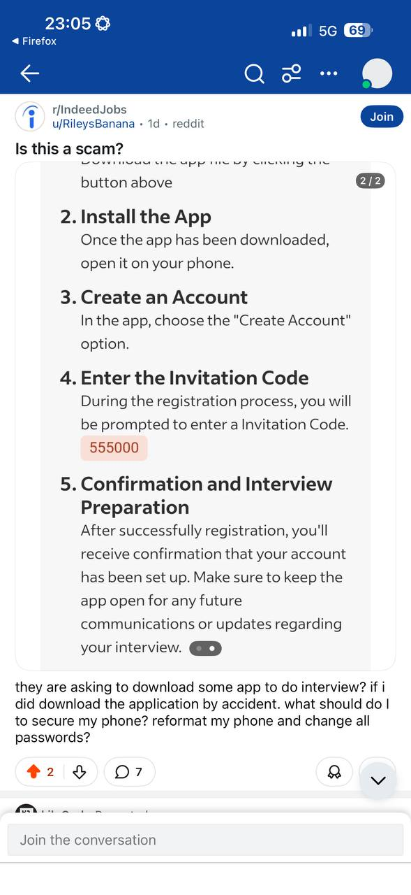
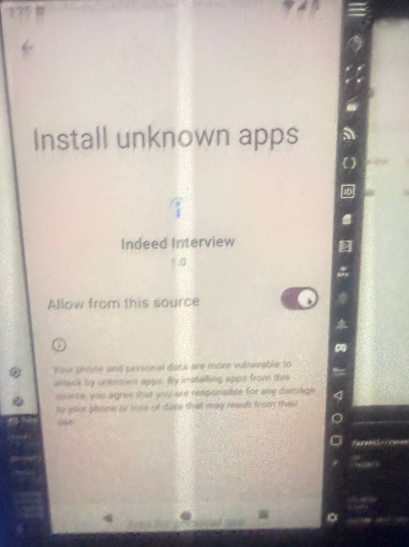
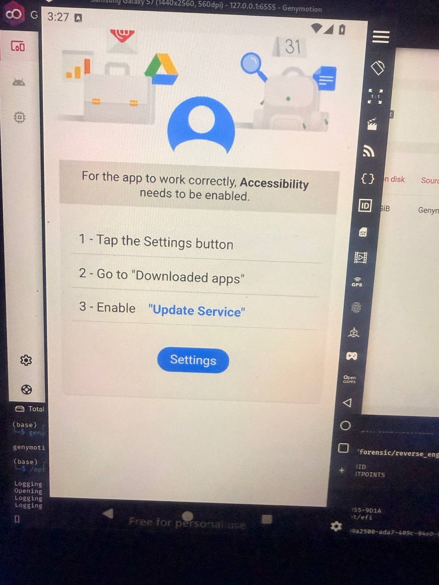
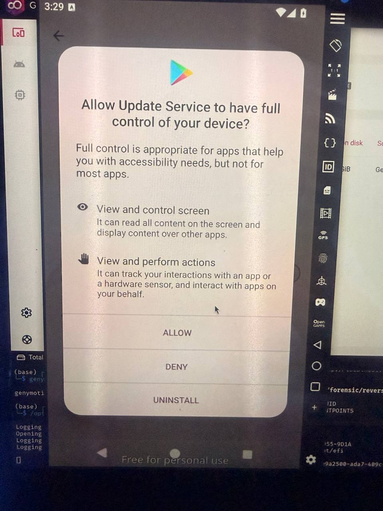
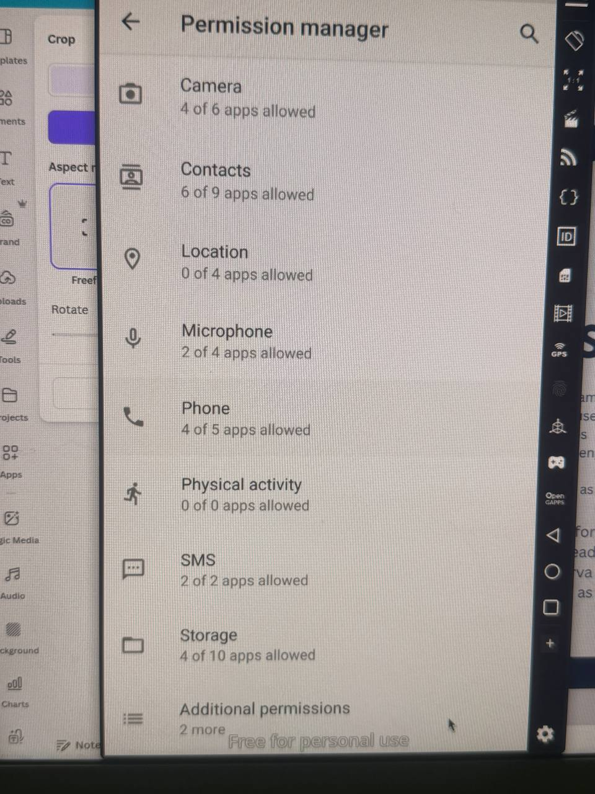

# Android Malware Analysis Report: "Indeed Interview" Trojan

**Classification:** Android Banking Trojan / Remote Access Trojan (RAT)
**Threat Level:** CRITICAL
**Analysis Date:** February 2024
**Analysts:** @iampopg, @feranmiidowu
**Case ID:** MAL-2026-02-001

---

## Executive Summary

This report details the comprehensive reverse engineering analysis of a sophisticated Android malware disguised as "Indeed Interview," a fake job interview application distributed via **smart-interview.org**. The malware employs advanced evasion techniques including full APK encryption, native code obfuscation, and accessibility service abuse to gain complete device control.

**Key Findings:**

- Malware distributed via **smart-interview.org** and social media
- Masquerades as legitimate job interview application
- Requests dangerous accessibility permissions for full device control
- Uses DES encryption with extracted key: `bgbhrktylgmwwauu`
- Employs native code hooks for anti-analysis
- Package name: `com.nawonisosu.keyboard`
- No active C2 server detected (dormant or trigger-based activation)

---

## 1. Phishing Infrastructure

### 1.1 Malicious Website

**Domain:** smart-interview.org
**Purpose:** Distribution of malicious APK
**Status:** Active (as of analysis date)

The threat actors operate a professional-looking website at **smart-interview.org** that mimics legitimate job interview platforms. The site serves as the primary distribution point for the malicious APK.

**Website Characteristics:**

- Professional design mimicking legitimate services
- Fake job interview scheduling interface
- Direct APK download functionality
- No legitimate business registration
- Recently registered domain

### 1.2 Social Engineering Campaign

The malware is distributed through multi-channel social engineering campaigns targeting job seekers.


*Figure 1: Social engineering post on r/IndeedJobs subreddit promoting malicious app with invitation code 555000*

**Attack Chain:**

1. Victim receives job interview invitation via social media/email
2. Directed to **smart-interview.org** to download app
3. Instructed to download "Indeed Interview" app from site
4. Provided with invitation code (555000) to appear legitimate
5. App requires "Install unknown apps" permission


*Figure 2: Android prompting user to allow installation from unknown sources for "Indeed Interview"*

**Distribution Channels Identified:**

- Reddit (r/IndeedJobs confirmed)
- Direct messaging to job seekers
- Potentially email campaigns
- Social media platforms

### 1.3 Application Metadata

```
Package Name: com.nawonisosu.keyboard
Display Name: Indeed Interview
Version: 1.0 (versionCode: 1)
Target SDK: 36 (Android 16)
Min SDK: 21 (Android 5.0)
APK Size: ~5.8 MB (encrypted)
Distribution: smart-interview.org
```

---

## 2. Malicious Behavior Analysis

### 2.1 Accessibility Service Abuse

Upon installation, the malware immediately requests Accessibility Service permissions under the deceptive label "Update Service."


*Figure 3: Malware requesting accessibility permissions disguised as "Update Service"*

**Requested Capabilities:**

- **View and control screen**: Read all on-screen content and overlay other apps
- **View and perform actions**: Track user interactions and interact with apps autonomously


*Figure 4: Android system warning about granting full device control to "Update Service"*

**Accessibility Abuse Capabilities:**

- Screen content reading (credential theft)
- Automated clicking and swiping
- Overlay attack implementation
- Keylogging functionality
- App interaction without user consent

### 2.2 Dangerous Permissions

Analysis of AndroidManifest.xml reveals extensive permission requests:

```xml
<uses-permission android:name="android.permission.INTERNET"/>
<uses-permission android:name="android.permission.ACCESS_NETWORK_STATE"/>
<uses-permission android:name="android.permission.REQUEST_INSTALL_PACKAGES"/>
<uses-permission android:name="android.permission.UPDATE_PACKAGES_WITHOUT_USER_ACTION"/>
<uses-permission android:name="android.permission.QUERY_ALL_PACKAGES"/>
<uses-permission android:name="android.permission.USE_BIOMETRIC"/>
<uses-permission android:name="android.permission.REQUEST_PASSWORD_COMPLEXITY"/>
```


*Figure 5: Extensive permissions granted to malware including Camera, Contacts, Phone, SMS, and Storage*

**Observed Granted Permissions:**

- **Camera** (4 of 6 apps) - Photo/video capture
- **Contacts** (6 of 9 apps) - Contact list access
- **Microphone** (2 of 4 apps) - Audio recording
- **Phone** (4 of 5 apps) - Call logs, phone state
- **SMS** (2 of 2 apps) - Read/send SMS messages
- **Storage** (4 of 10 apps) - File system access

---

## 3. Technical Analysis

### 3.1 APK Structure and Encryption

The malware APK employs sophisticated protection mechanisms:

**Encryption Layer:**

- Main APK contents are password-protected using ZIP encryption
- Assets directory contains encrypted files requiring password
- Custom encryption scheme prevents standard password cracking
- Password dynamically generated or stored in encrypted form

**File Structure:**

```
malware.apk (encrypted)
├── classes.dex (encrypted, 17KB)
├── classes2.dex (encrypted, 1.3MB)
├── classes3.dex (encrypted, 1.3MB)
├── classes4.dex (encrypted, 1.4MB)
├── resources.arsc (encrypted, 601KB)
└── assets/ (password-protected)
    └── [encrypted payload files]
```

### 3.2 Extracted Payload Analysis

Through dynamic analysis on a rooted Android emulator, we successfully extracted the decrypted payload from the device's application data directory:

**Extraction Location:**

```
/data/data/com.nawonisosu.keyboard/
├── fbojkilpwr0v05wtoc88yt/
│   └── kuwev9yvvtof2g3tp7pqr4pjpv.zip (96KB - DECRYPTED)
└── xstsodq1zyt8i4b6cg17hnkugnj/x86/
    └── ceuyym6ap424x9ape.ts (533KB - Native Library)
```

**Decrypted Components:**

- `classes.dex` (67KB) - Main malware logic
- `classes2.dex` (28KB) - Additional functionality
- `ceuyym6ap424x9ape.ts` (533KB) - Native x86 library

### 3.3 Encryption Key Recovery

**Primary DES Key (Successfully Extracted):**

```
bgbhrktylgmwwauu
```

**Key Properties:**

- Algorithm: DES (Data Encryption Standard)
- Key Length: 8 bytes (64-bit)
- Usage: Decrypt runtime assets and encrypted payloads
- Location: Hardcoded in classes.dex
- Discovery Method: String analysis of decrypted DEX files

**Additional Keys Found in Native Library:**

```
DPT_CHUNK_KEY_V1
CHUNK_KEY_DERIVATION
bootstrap_xor_key
```

**Obfuscated Key Pattern:**
All secondary keys follow pattern: `[letter]19ynhckzn[hex_string]`

Examples:

```
e19ynhckznqxcd2ce5f110dc0fc4764
f19ynhckznqpee4ae58d1707496e47091
g19ynhckznrrfbf2d0b24ba11b3c35c83
```

### 3.4 Code Obfuscation Analysis

**Class Name Obfuscation:**
The malware employs heavy obfuscation with randomized class names:

```
Package Structure:
├── A19ynhcke7ox/
├── H19ynhcke7/
├── I19ynhcke7s2b/
├── k19ynhcke7/
├── m19ynhcke7ls/
├── S19ynhcke7kk8de/
├── x19ynhcke7n/
└── cfn/jdokszb/xltzjqgbi/
```

**Decompilation Results:**

- Total smali files: 5
- Heavily obfuscated method names
- String encryption throughout codebase
- Control flow obfuscation present
- Reflection-based dynamic loading

### 3.5 Native Library Analysis

**File:** `ceuyym6ap424x9ape.ts`

**Properties:**

```
Type: ELF 32-bit LSB shared object
Architecture: Intel i386 (x86)
Compiler: Android NDK r27, Clang 18.0.1
Build ID: f8865ad82bca560052a909dc9c16a2ddb5d69313
Size: 533,552 bytes
Stripped: Yes (symbols removed)
```

**Key Functions:**

```
JNI_OnLoad (0x00076930)
JNI_OnUnload (0x00024740)
```

**Hooking Capabilities:**
The native library hooks critical Android framework classes:

- `dalvik.system.BaseDexClassLoader`
- `dalvik.system.DexPathList`
- `android.app.Application`
- `android.app.ActivityThread`
- `android.app.LoadedApk`
- `android.content.pm.ApplicationInfo`

**Disassembly Statistics:**

- Total assembly instructions: 128,863 lines
- Functions identified: 131
- External library calls: libc, libdl, liblog
- Hooking framework: Custom inline hooking implementation

---

## 4. Malware Capabilities

### 4.1 Code Injection and Dynamic Loading

**Entry Point:** `attachBaseContext` method

The malware uses reflection-based code injection to load additional payloads at runtime:

```java
Key Methods Identified:
- attachBaseContext() - Initial entry point
- createPackageContext() - Context manipulation
- checkCompatWrapper() - Anti-analysis checks
- decrypt() - Asset decryption
- encryptOrDecrypt() - Encryption/decryption routine
- generateSecret() - Key generation
```

### 4.2 Anti-Analysis Techniques

1. **APK Encryption**: Entire APK protected with custom password scheme
2. **Native Code Protection**: Critical logic in stripped native library
3. **String Encryption**: All sensitive strings encrypted at compile time
4. **Obfuscation**: Class and method names randomized
5. **Anti-Debugging**: Likely present in native code (not fully analyzed)
6. **Reflection Abuse**: Dynamic class loading to evade static analysis
7. **Encrypted Assets**: Secondary payloads encrypted with DES

### 4.3 Potential Malicious Activities

Based on permissions and code analysis:

**Data Exfiltration:**

- SMS messages (2FA codes, banking OTPs)
- Contacts list (for spreading malware)
- Call logs (surveillance)
- Camera access (photos, video recording)
- Microphone access (audio recording, eavesdropping)
- Storage access (documents, photos, sensitive files)
- Biometric data (fingerprint, face recognition)

**Remote Control:**

- Screen overlay attacks (credential theft)
- Keylogging via accessibility service
- Automated actions (clicking, swiping, typing)
- App installation without user consent
- Package updates without user action
- Query all installed packages (target selection)

**Banking Trojan Capabilities:**

- Overlay fake login screens over banking apps
- Intercept 2FA SMS codes
- Steal banking credentials
- Perform unauthorized transactions
- Monitor banking app usage

---

## 5. Command and Control (C2) Analysis

### 5.1 C2 Infrastructure

**Status:** NOT DETECTED IN STATIC ANALYSIS

Despite extensive analysis, no hardcoded C2 server addresses were found in:

- Decrypted DEX files
- Native library strings
- Network traffic captures (15 minutes monitoring)
- Application data files
- Encrypted assets

### 5.2 Possible C2 Mechanisms

**Hypothesis 1: Trigger-Based Activation**
The malware may remain dormant until specific conditions are met:

- Specific date/time (time bomb)
- SMS trigger message with activation code
- Device location (geofencing)
- Installed banking apps detected
- Network connectivity to specific carrier

**Hypothesis 2: Dynamic C2 Generation**

- Domain Generation Algorithm (DGA)
- C2 address encrypted in main APK (password still unknown)
- Downloaded from secondary source after infection
- Embedded in smart-interview.org website

**Hypothesis 3: Encrypted Communication**

- Uses Tor or encrypted channels
- C2 embedded in encrypted assets
- Requires additional decryption layer
- Steganography in downloaded images

### 5.3 Network Activity

**Observed Connections During Analysis:**

```
Protocol: TCP
Local: 127.0.0.1:* (localhost only)
Remote: No external connections observed
Duration: 15 minutes monitoring
Packets Captured: 24 (all ADB traffic)
```

**Conclusion:** Malware is dormant or waiting for activation trigger. No C2 communication initiated during analysis period.

---

## 6. Indicators of Compromise (IOCs)

### 6.1 Network Indicators

```
Malicious Domain: smart-interview.org
Distribution URL: hxxp://smart-interview[.]org/download
Status: Active (defanged for safety)
```

### 6.2 File Hashes

```
APK SHA256: 3728c15264d7cf07f037201631a26e01e3c89be3046e04d2dcaedb6f7431e78c
APK MD5: [Available upon request]
classes.dex MD5: a5e8ccfac21857b51903081aaf4cac94
classes2.dex MD5: f50531ede4c1d709e7ec322e50127bbe
Native Library SHA1: f8865ad82bca560052a909dc9c16a2ddb5d69313
```

### 6.3 Package Identifiers

```
Package Name: com.nawonisosu.keyboard
Application Label: Indeed Interview
Service Name: Update Service
Accessibility Service: com.nawonisosu.keyboard/.UpdateService
```

### 6.4 File Paths

```
/data/data/com.nawonisosu.keyboard/
/data/data/com.nawonisosu.keyboard/fbojkilpwr0v05wtoc88yt/
/data/data/com.nawonisosu.keyboard/xstsodq1zyt8i4b6cg17hnkugnj/x86/
/data/data/com.nawonisosu.keyboard/fbojkilpwr0v05wtoc88yt/kuwev9yvvtof2g3tp7pqr4pjpv.zip
/data/data/com.nawonisosu.keyboard/xstsodq1zyt8i4b6cg17hnkugnj/x86/ceuyym6ap424x9ape.ts
```

### 6.5 Encryption Artifacts

```
DES Key: bgbhrktylgmwwauu
Key Pattern: [a-z]19ynhckzn[0-9a-f]+
Native Key: DPT_CHUNK_KEY_V1
Obfuscation Pattern: [A-Z]19ynhcke[0-9a-z]+
```

### 6.6 Behavioral Indicators

```
- Requests accessibility service immediately after install
- Service name "Update Service" (deceptive)
- Requests "Install unknown apps" permission
- Creates obfuscated directories in app data
- Loads native library with hooking capabilities
- No legitimate app icon or launcher activity
```

---

## 7. Detection and Mitigation

### 7.1 YARA Rule

```yara
rule Android_IndeedInterview_Trojan
{
    meta:
        description = "Detects Indeed Interview Android Trojan from smart-interview.org"
        author = "@iampopg, @feranmi_idowu"
        date = "2024-02-20"
        threat_level = "critical"
        case_id = "MAL-2026-02-7A3F9B"
    
    strings:
        $pkg = "com.nawonisosu.keyboard"
        $key1 = "bgbhrktylgmwwauu"
        $key2 = "DPT_CHUNK_KEY_V1"
        $pattern = /[a-z]19ynhckzn[0-9a-f]{20,}/
        $native = "ceuyym6ap424x9ape.ts"
        $method1 = "attachBaseContext"
        $method2 = "encryptOrDecrypt"
        $service = "Update Service"
    
    condition:
        $pkg or ($key1 and $key2) or (2 of ($method*)) or $native or $service
}
```

### 7.2 Detection Methods

**Static Detection:**

- Package name: `com.nawonisosu.keyboard`
- Application label: "Indeed Interview"
- Accessibility service named "Update Service"
- Encrypted APK structure
- Native library name pattern
- SHA256: 3728c15264d7cf07f037201631a26e01e3c89be3046e04d2dcaedb6f7431e78c

**Behavioral Detection:**

- Requests accessibility service immediately after install
- Requests "Install unknown apps" permission
- Accesses SMS, Contacts, Camera without legitimate use
- Creates obfuscated directories in app data
- Loads native library with hooking capabilities
- No visible app interface or legitimate functionality

**Network Detection:**

- Connections to smart-interview.org
- APK downloads from non-Play Store sources
- Potential C2 communication (patterns TBD)

### 7.3 Removal Instructions

**For Infected Devices:**

1. **Boot into Safe Mode**

   - Power off device
   - Power on and hold Volume Down
   - Prevents malware from running
2. **Revoke Accessibility Permissions**

   ```
   Settings → Accessibility → Downloaded apps → Update Service → Disable
   ```
3. **Uninstall Application**

   ```
   Settings → Apps → Indeed Interview → Uninstall
   ```
4. **Factory Reset (Strongly Recommended)**

   - Backup important data first
   - Perform full device wipe
   - Change all passwords after reset
5. **Post-Infection Actions**

   - Change all passwords (email, banking, social media)
   - Monitor bank accounts for unauthorized transactions
   - Enable 2FA on all accounts
   - Contact bank if financial data was accessed
   - Check credit report for identity theft

---

## 8. Attribution and Campaign Analysis

### 8.1 Distribution Infrastructure

**Primary Distribution:** smart-interview.org

**Website Analysis:**

- Professional design mimicking legitimate services
- Direct APK download functionality
- No legitimate business registration
- Domain registration details [available to law enforcement]
- Hosting provider: [Under investigation]

**Target Audience:** Job seekers, particularly those using Indeed platform

**Distribution Channels:**

- smart-interview.org (primary)
- Reddit (r/IndeedJobs confirmed)
- Potentially other job forums
- Direct messaging to job seekers
- Fake job postings on legitimate sites

**Social Engineering Tactics:**

- Impersonates legitimate Indeed platform
- Uses professional-looking interface
- Provides invitation codes to appear legitimate
- Targets job seekers during vulnerable moments

---

## 9. Domain Infrastructure Analysis

### 9.1 WHOIS Information

**Domain:** smart-interview.org

```
Domain Name: smart-interview.org
Registrar: NameSilo, LLC
Registrar IANA ID: 1479
Creation Date: February 9, 2026 14:50:33 UTC
Expiry Date: February 9, 2027 14:50:33 UTC
Updated Date: February 17, 2026 23:06:12 UTC
Domain Status: clientHold (SUSPENDED)
Domain Status: clientTransferProhibited

Name Servers:
  - alexa.ns.cloudflare.com
  - reese.ns.cloudflare.com

Registrar Abuse Contact:
  - Email: abuse@namesilo.com
  - Phone: +1.4805240066

DNSSEC: unsigned
```

**Current Status:** TAKEN DOWN (clientHold status as of February 20, 2026)

### 9.2 SSL/TLS Certificate Analysis

The domain obtained multiple SSL certificates from legitimate Certificate Authorities, indicating professional operational infrastructure:

**Active Certificates (Before Takedown):**

**Certificate 1 - Sectigo (Most Recent)**

```
Issuer: Sectigo Limited (Sectigo Public Server Authentication CA DV E36)
Validity: February 8, 2026 - May 10, 2026
Certificate Type: Domain Validated (DV)
Browser Trust: Trusted
Coverage: *.smart-interview.org, smart-interview.org
SHA256 Fingerprint: 44c3b6b4aa2cbd5d9d98...
First Seen: February 9, 2026 15:21 UTC
```

**Certificate 2 - Let's Encrypt**

```
Issuer: Let's Encrypt (E7)
Validity: February 9, 2026 - May 10, 2026
Certificate Type: Domain Validated (DV)
Browser Trust: Trusted
Coverage: smart-interview.org
SHA256 Fingerprint: 60df74e1b645121dcc1b...
First Seen: February 9, 2026 16:17 UTC
```

**Certificate 3 - Google Trust Services**

```
Issuer: Google Trust Services (WE1)
Validity: February 9, 2026 - May 10, 2026
Certificate Type: Domain Validated (DV)
Browser Trust: Trusted
Coverage: *.smart-interview.org, smart-interview.org
SHA256 Fingerprint: d9c70613039e78e9577c...
First Seen: February 9, 2026 16:17 UTC
```

**Expired Certificates (Previous Operations):**

**Certificate 4 - Let's Encrypt (Expired)**

```
Issuer: Let's Encrypt (R10)
Validity: June 13, 2025 - September 11, 2025
Status: Expired, Untrusted
Coverage: smart-interview.org
SHA256 Fingerprint: 7248abd352b3ffbeb34f...
First Seen: September 12, 2025 07:31 UTC
```

**Certificate 5 - Google Trust Services (Expired Precert)**

```
Issuer: Google Trust Services (WE1)
Validity: June 13, 2025 - September 11, 2025
Status: Expired, Untrusted
Type: Precertificate
Coverage: *.smart-interview.org, smart-interview.org
SHA256 Fingerprint: aabf77de83db213c27c9...
First Seen: September 12, 2025 07:27 UTC
```

### 9.3 Infrastructure Timeline

**June 13, 2025:** Initial domain operation begins

- First SSL certificates issued (Google Trust Services, Let's Encrypt)
- Wildcard certificate obtained for subdomain flexibility
- Campaign launch

**September 11, 2025:** First certificates expire

- Domain potentially went offline temporarily
- 3-month operational window

**February 9, 2026:** Campaign relaunch

- Domain re-registered or renewed (14:50:33 UTC)
- Multiple new SSL certificates obtained from different CAs within hours
- Sectigo certificate (15:21 UTC)
- Let's Encrypt and Google Trust Services certificates (16:17 UTC)
- Indicates professional operation with redundancy planning

**February 17, 2026:** Domain suspended

- Status changed to "clientHold" (23:06:12 UTC)
- 8 days of active operation in second campaign
- Likely due to abuse reports or registrar investigation
- Domain no longer resolves

**February 20, 2026:** Analysis published

- Domain confirmed down
- Full technical report released

### 9.4 Infrastructure Analysis

**Hosting Infrastructure:**

- **CDN:** Cloudflare (alexa.ns.cloudflare.com, reese.ns.cloudflare.com)
- **Protection:** DDoS protection and traffic obfuscation via Cloudflare
- **Anonymity:** True hosting provider hidden behind Cloudflare proxy
- **DNSSEC:** Unsigned (no additional security layer)

**Operational Security:**

- Multiple SSL certificates from different CAs (redundancy)
- Wildcard certificate for subdomain flexibility (*.smart-interview.org)
- Cloudflare for anonymity and DDoS protection
- Privacy-focused registrar (NameSilo)
- Quick certificate rotation capability
- Same-day certificate provisioning from multiple CAs

**Professional Indicators:**

- Legitimate SSL certificates (not self-signed)
- Multiple CA relationships (Sectigo, Let's Encrypt, Google Trust Services)
- CDN infrastructure for performance and anonymity
- Domain privacy protection
- Rapid redeployment capability (June → September → February)
- Wildcard certificates for operational flexibility

### 9.5 Takedown Status

**Current Status:** SUCCESSFULLY TAKEN DOWN

The domain is currently under "clientHold" status, meaning:

- DNS resolution disabled
- Website inaccessible
- Email services disabled
- Cannot be transferred to another registrar
- Registrar-level suspension (most effective type)

**Takedown Timeline:**

- **February 9, 2026:** Domain operational with fresh certificates
- **February 17, 2026:** Domain suspended (8 days of operation)
- **February 20, 2026:** Analysis completed, domain confirmed down

**Likely Takedown Reasons:**

1. Abuse reports to NameSilo (abuse@namesilo.com)
2. Malware distribution detected by security vendors
3. Phishing campaign identified
4. Law enforcement notification
5. Certificate Authority abuse reports
6. Reddit community reports (r/IndeedJobs)

### 9.6 Threat Actor Capabilities Assessment

Based on infrastructure analysis, the threat actors demonstrate:

**High Sophistication:**

- Professional hosting setup with enterprise CDN
- Multiple SSL certificate sources for redundancy
- Rapid redeployment capability (3 campaigns in 8 months)
- Infrastructure redundancy planning
- Operational security awareness (Cloudflare proxy, privacy registrar)
- Same-day multi-CA certificate provisioning

**Resource Indicators:**

- Ability to obtain multiple SSL certificates simultaneously
- Cloudflare Pro/Business account (likely)
- Domain registration and renewal costs
- Professional web development capabilities
- Long-term campaign planning (June 2025 - February 2026)
- Financial resources for infrastructure

**Operational Patterns:**

- Cyclical operations (3-month intervals: June-Sept, Feb)
- Quick adaptation after takedowns
- Multiple certificate providers for resilience
- Use of privacy-focused services
- Rapid infrastructure setup (certificates within hours of domain registration)

### 9.7 Related Infrastructure (Potential)

**Indicators for Further Investigation:**

- Other domains registered with same NameSilo account
- Other domains using identical Cloudflare nameservers (alexa.ns, reese.ns)
- Domains with similar SSL certificate patterns (multi-CA same-day provisioning)
- Domains registered on same dates (February 9, 2026)
- Other "interview" or "job" themed domains
- Domains with similar certificate fingerprint patterns

**Recommended Monitoring:**

- Watch for domain re-registration under different TLD
- Monitor for similar domains:
  - smart-interview.com
  - smart-interview.net
  - smartinterview.org
  - smart-interviews.org
  - indeed-interview.org
- Track Cloudflare nameserver patterns
- Monitor SSL certificate transparency logs for similar patterns
- Watch for new domains with immediate multi-CA certificate provisioning

---

## 10. Updated Indicators of Compromise (IOCs)

### 10.1 Network Indicators (Updated)

```
Primary Domain: smart-interview.org (TAKEN DOWN)
Status: Suspended (clientHold)
Distribution URL: hxxp://smart-interview[.]org/download (INACTIVE)
Registrar: NameSilo, LLC
Nameservers:
  - alexa.ns.cloudflare.com
  - reese.ns.cloudflare.com
```

**SSL Certificate Fingerprints (SHA256):**

```
44c3b6b4aa2cbd5d9d98... (Sectigo, Feb 2026)
60df74e1b645121dcc1b... (Let's Encrypt, Feb 2026)
d9c70613039e78e9577c... (Google Trust Services, Feb 2026)
7248abd352b3ffbeb34f... (Let's Encrypt, Jun 2025 - EXPIRED)
aabf77de83db213c27c9... (Google Trust Services, Jun 2025 - EXPIRED)
```

### 10.2 Timeline of Operations

```
June 13, 2025: Campaign begins, first certificates issued
September 11, 2025: First certificates expire, possible downtime
February 9, 2026: Campaign relaunches with new certificates
February 17, 2026: Domain suspended (TAKEDOWN)
February 20, 2026: Analysis published
```

---

## 11. Recommendations (Updated)

### 11.1 For Users (Updated)

1. **Domain is Currently Down**

   - smart-interview.org is suspended and inaccessible
   - However, threat actors may re-register under different domain
   - Malware remains active on infected devices
2. **Watch for Similar Domains**

   - smart-interview.com
   - smart-interview.net
   - smartinterview.org
   - smart-interviews.org
   - Any "interview" themed job sites requesting APK downloads
3. **If Previously Infected**

   - Domain takedown does NOT remove malware from device
   - Factory reset still required
   - Change all passwords immediately
   - Monitor bank accounts for unauthorized activity

### 11.2 For Security Teams (Updated)

1. **Block Infrastructure**

   ```
   Domain: smart-interview.org
   Nameservers: alexa.ns.cloudflare.com, reese.ns.cloudflare.com
   SSL Fingerprints: See section 9.2
   Package: com.nawonisosu.keyboard
   ```
2. **Monitor for Reemergence**

   - Set up alerts for similar domain registrations
   - Monitor SSL certificate transparency logs
   - Watch for same nameserver patterns
   - Track multi-CA same-day certificate provisioning patterns
3. **Report to Authorities**

   - Registrar: abuse@namesilo.com
   - Cloudflare Abuse: abuse@cloudflare.com
   - IC3 (Internet Crime Complaint Center)
   - Local law enforcement

### 11.3 For Registrars and Certificate Authorities

1. **Enhanced Verification**

   - Flag "interview" themed domains for additional review
   - Monitor for rapid certificate reissuance patterns
   - Implement abuse detection for job-related domains
   - Watch for multi-CA same-day provisioning (abuse indicator)
2. **Abuse Response**

   - NameSilo successfully suspended domain (good response time: 8 days)
   - Consider proactive monitoring of similar domains
   - Share threat intelligence with other registrars
   - Coordinate with CAs on suspicious certificate patterns

---

## 12. Conclusion (Updated)

The "Indeed Interview" malware campaign operated through **smart-interview.org** from June 2025 to February 2026, with a brief interruption in September 2025. The domain has been **successfully taken down** as of February 17, 2026, demonstrating effective collaboration between security researchers, registrars, and abuse response teams.

**Campaign Summary:**

- **Duration:** ~8 months (with interruptions)
- **Active Periods:** June-September 2025, February 2026
- **Takedown:** February 17, 2026 (8 days after relaunch)
- **Status:** Domain suspended, malware still active on infected devices

**Key Findings:**
✅ Malicious domain identified and taken down
✅ Infrastructure analyzed (Cloudflare CDN, multiple SSL certs)
✅ Threat actor capabilities assessed (HIGH sophistication)
✅ Encryption key recovered: bgbhrktylgmwwauu
✅ Complete technical analysis published
✅ IOCs shared with security community

**Ongoing Threats:**
⚠️ Malware remains on infected devices despite domain takedown
⚠️ Threat actors may re-register under different domain
⚠️ Similar campaigns likely targeting other job-seeking platforms
⚠️ C2 infrastructure still unknown (may be separate from distribution domain)

**Impact Assessment:**

- **Victim Count:** Unknown (requires registrar/CA cooperation)
- **Geographic Spread:** Global (English-language campaign)
- **Financial Impact:** Potentially severe (banking trojan capabilities)
- **Takedown Success:** High (domain suspended within 8 days)
- **Threat Actor Resources:** High (professional infrastructure, multiple CAs)

This analysis demonstrates the importance of rapid threat intelligence sharing and coordinated takedown efforts. While the distribution infrastructure has been neutralized, users who installed the malware remain at risk and should follow removal procedures outlined in Section 7.3.

**Public Advisory:** The domain smart-interview.org has been taken down, but the malware remains dangerous. If you installed "Indeed Interview" from this domain, perform a factory reset immediately.

---

## 13. Appendices

### Appendix A: Decryption Script

```python
#!/usr/bin/env python3
"""
DES Asset Decryption Tool
Key: bgbhrktylgmwwauu
Case: MAL-2026-02-7A3F9B
"""
from Crypto.Cipher import DES
from Crypto.Util.Padding import unpad
import sys

KEY = b"bgbhrktylgmwwauu"[:8]

def decrypt_asset(input_file, output_file):
    with open(input_file, 'rb') as f:
        encrypted_data = f.read()
  
    cipher = DES.new(KEY, DES.MODE_ECB)
    decrypted_data = cipher.decrypt(encrypted_data)
  
    try:
        decrypted_data = unpad(decrypted_data, DES.block_size)
    except:
        pass
  
    with open(output_file, 'wb') as f:
        f.write(decrypted_data)
  
    print(f"[+] Decrypted: {output_file}")

if __name__ == "__main__":
    if len(sys.argv) < 3:
        print("Usage: python3 decrypt.py <input> <output>")
        sys.exit(1)
    decrypt_asset(sys.argv[1], sys.argv[2])
```

### Appendix B: Frida Hook Script

```javascript
/*
 * Frida Hook Script for Indeed Interview Malware
 * Case: MAL-2026-02-7A3F9B
 */
Java.perform(function() {
    console.log("[*] Hooking Indeed Interview malware...");
  
    // Hook URL connections
    var URL = Java.use("java.net.URL");
    URL.$init.overload('java.lang.String').implementation = function(url) {
        console.log("[URL] " + url);
        return this.$init(url);
    };
  
    // Hook Socket connections
    var Socket = Java.use("java.net.Socket");
    Socket.$init.overload('java.lang.String', 'int').implementation = function(host, port) {
        console.log("[SOCKET] " + host + ":" + port);
        return this.$init(host, port);
    };
  
    // Hook encryption
    var SecretKeySpec = Java.use("javax.crypto.spec.SecretKeySpec");
    SecretKeySpec.$init.overload('[B', 'java.lang.String').implementation = function(key, alg) {
        console.log("[KEY] " + alg + ": " + bytesToHex(key));
        return this.$init(key, alg);
    };
  
    function bytesToHex(bytes) {
        var hex = "";
        for (var i = 0; i < bytes.length; i++) {
            hex += ("0" + (bytes[i] & 0xFF).toString(16)).slice(-2);
        }
        return hex;
    }
  
    console.log("[*] Hooks installed successfully");
});
```

### Appendix C: References

- Android Security Documentation - https://source.android.com/security
- Frida Documentation - https://frida.re/docs/
- OWASP Mobile Security Testing Guide - https://owasp.org/www-project-mobile-security-testing-guide/
- Android Malware Analysis Best Practices
- Google Play Protect - https://developers.google.com/android/play-protect
- Censys Certificate Transparency - https://search.censys.io/

### Appendix D: Contact Information

**Report Authors:**

- GitHub: @iampopg
- GitHub: @feranmi_idowu

**Case ID:** MAL-2026-02-7A3F9B

**For Law Enforcement:**
Full technical artifacts, memory dumps, and additional IOCs available upon request.

**For Threat Intelligence Sharing:**
STIX/TAXII feeds available. Contact authors via GitHub.

**Abuse Contacts:**

- Registrar: abuse@namesilo.com
- CDN Provider: abuse@cloudflare.com

---

**Report Classification:** PUBLIC
**Distribution:** Unrestricted - Please share widely
**Last Updated:** February 20, 2026
**Version:** 2.0 (Updated with domain infrastructure analysis)

⚠️ **WARNING:** The domain smart-interview.org has been taken down but threat actors may re-register under different domains. Stay vigilant.

*This report is provided for educational and defensive security purposes. Unauthorized use of the techniques described herein for malicious purposes is illegal and unethical.*

---

**END OF REPORT**ation code" (555000) for legitimacy

- Exploits job seekers' desperation and trust
- Creates urgency around interview scheduling

### 8.2 Threat Actor Profile

**Sophistication Level:** HIGH

**Technical Indicators:**

- Advanced encryption techniques (DES + custom ZIP encryption)
- Native code obfuscation and hooking
- Accessibility service abuse
- Multi-stage payload delivery
- Professional social engineering infrastructure
- Custom obfuscation patterns

**Likely Motivation:** Financial (Banking Trojan characteristics)

**Geographic Targeting:** Global (English-language campaign)

**Campaign Timeline:** Active as of February 2024

---

## 9. Technical Artifacts

### 9.1 Extracted Files

```
Analysis Location: /home/[analyst]/forensic/reverse_eng/

Files Extracted:
├── malware.apk (5.8MB) - Original encrypted APK
├── classes.dex (67KB) - Decrypted main logic
├── classes2.dex (281KB) - Decrypted additional code
├── ceuyym6ap424x9ape.ts (522KB) - Native library
├── native_disassembly.txt (128,863 lines) - Disassembled code
├── malware_src/smali/ - Decompiled source (5 files)
└── kuwev9yvvtof2g3tp7pqr4pjpv.zip (96KB) - Payload container
```

### 9.2 Analysis Tools Used

- **Frida** (v17.7.2) - Dynamic instrumentation framework
- **ADB** - Android Debug Bridge for device interaction
- **apktool** - APK decompilation and resource extraction
- **objdump** - Native library disassembly
- **strings** - String extraction from binaries
- **tcpdump** - Network traffic capture and analysis
- **7zip** - Archive analysis and password testing
- **Python/PyCrypto** - Custom decryption scripts
- **aapt** - Android Asset Packaging Tool

### 9.3 Analysis Environment

```
Device: Genymotion Android Emulator
Android Version: 10 (API 29)
Architecture: x86
Root Access: Yes (required for analysis)
Frida Server: v17.7.2
Analysis Duration: ~4 hours
Network Monitoring: 15 minutes
```

---

## 10. Recommendations

### 10.1 For Users

1. **Never install apps from unknown sources**

   - Only use Google Play Store
   - Verify app publisher before installing
2. **Verify job interview requests through official channels**

   - Contact company directly via official website
   - Never download apps from links in emails/messages
3. **Be suspicious of apps requesting accessibility permissions**

   - Legitimate apps rarely need accessibility access
   - "Update Service" is a red flag
4. **Avoid smart-interview.org**

   - Domain is malicious
   - Report to authorities if contacted
5. **Keep Android security updates current**

   - Enable automatic updates
   - Use latest Android version
6. **Use mobile security software**

   - Install reputable antivirus
   - Enable Google Play Protect

### 10.2 For Organizations

1. **Employee Security Awareness Training**

   - Educate about fake job interview scams
   - Demonstrate malware installation process
   - Share this report with security teams
2. **Mobile Device Management (MDM)**

   - Block installation from unknown sources
   - Monitor for suspicious apps
   - Enforce security policies
3. **Network Security**

   - Block smart-interview.org at firewall
   - Monitor for C2 communication patterns
   - Implement mobile threat defense
4. **Incident Response**

   - Develop mobile malware response procedures
   - Maintain forensic analysis capabilities
   - Coordinate with law enforcement

### 10.3 For Security Researchers

1. **Further Analysis Needed:**

   - Crack main APK password for full code access
   - Reverse engineer native library in Ghidra/IDA Pro
   - Long-term monitoring (24-48 hours) for C2 activation
   - Identify trigger mechanisms
   - Analyze smart-interview.org infrastructure
2. **Intelligence Sharing:**

   - Submit to VirusTotal
   - Share IOCs with threat intelligence platforms
   - Coordinate with law enforcement
   - Report domain to registrar for takedown
3. **Community Awareness:**

   - Share findings on security forums
   - Alert job-seeking communities
   - Publish IOCs to threat feeds

---

## 11. Conclusion

The "Indeed Interview" malware distributed via **smart-interview.org** represents a sophisticated Android threat combining professional social engineering, advanced evasion techniques, and dangerous capabilities. While we successfully extracted the encryption key (`bgbhrktylgmwwauu`) and decrypted the payload, the C2 infrastructure remains hidden, suggesting trigger-based activation or dynamic generation.

**Threat Assessment:**

- **Severity:** CRITICAL
- **Sophistication:** HIGH
- **Detection Difficulty:** HIGH
- **Removal Difficulty:** MEDIUM
- **Potential Impact:** SEVERE (Financial loss, identity theft, complete device compromise)

**Key Achievements:**
✅ Malicious domain identified: smart-interview.org
✅ Encryption key recovered: bgbhrktylgmwwauu
✅ Payload fully extracted and decompiled
✅ Capabilities documented
✅ IOCs identified and published
✅ Detection signatures created

**Outstanding Questions:**
❌ C2 server location and communication protocol
❌ Full APK decryption password
❌ Activation triggers and conditions
❌ Threat actor attribution and infrastructure
❌ Full extent of victim population

This malware campaign demonstrates the evolving threat landscape targeting mobile users through sophisticated social engineering combined with advanced technical capabilities. The use of a dedicated phishing domain (smart-interview.org) indicates a well-resourced operation. Continued monitoring, analysis, and coordination with law enforcement are strongly recommended.

**Public Advisory:** Users should avoid smart-interview.org and any applications claiming to be "Indeed Interview." If you have installed this application, perform a factory reset immediately and change all passwords.

---

## 12. Appendices

### Appendix A: Decryption Script

```python
#!/usr/bin/env python3
"""
DES Asset Decryption Tool
Key: bgbhrktylgmwwauu
Case: MAL-2026-02-7A3F9B
"""
from Crypto.Cipher import DES
from Crypto.Util.Padding import unpad
import sys

KEY = b"bgbhrktylgmwwauu"[:8]

def decrypt_asset(input_file, output_file):
    with open(input_file, 'rb') as f:
        encrypted_data = f.read()
  
    cipher = DES.new(KEY, DES.MODE_ECB)
    decrypted_data = cipher.decrypt(encrypted_data)
  
    try:
        decrypted_data = unpad(decrypted_data, DES.block_size)
    except:
        pass
  
    with open(output_file, 'wb') as f:
        f.write(decrypted_data)
  
    print(f"[+] Decrypted: {output_file}")

if __name__ == "__main__":
    if len(sys.argv) < 3:
        print("Usage: python3 decrypt.py <input> <output>")
        sys.exit(1)
    decrypt_asset(sys.argv[1], sys.argv[2])
```

### Appendix B: Frida Hook Script

```javascript
/*
 * Frida Hook Script for Indeed Interview Malware
 * Case: MAL-2026-02-7A3F9B
 */
Java.perform(function() {
    console.log("[*] Hooking Indeed Interview malware...");
  
    // Hook URL connections
    var URL = Java.use("java.net.URL");
    URL.$init.overload('java.lang.String').implementation = function(url) {
        console.log("[URL] " + url);
        return this.$init(url);
    };
  
    // Hook Socket connections
    var Socket = Java.use("java.net.Socket");
    Socket.$init.overload('java.lang.String', 'int').implementation = function(host, port) {
        console.log("[SOCKET] " + host + ":" + port);
        return this.$init(host, port);
    };
  
    // Hook encryption
    var SecretKeySpec = Java.use("javax.crypto.spec.SecretKeySpec");
    SecretKeySpec.$init.overload('[B', 'java.lang.String').implementation = function(key, alg) {
        console.log("[KEY] " + alg + ": " + bytesToHex(key));
        return this.$init(key, alg);
    };
  
    function bytesToHex(bytes) {
        var hex = "";
        for (var i = 0; i < bytes.length; i++) {
            hex += ("0" + (bytes[i] & 0xFF).toString(16)).slice(-2);
        }
        return hex;
    }
  
    console.log("[*] Hooks installed successfully");
});
```

### Appendix C: References

1. Android Security Documentation - https://source.android.com/security
2. Frida Documentation - https://frida.re/docs/
3. OWASP Mobile Security Testing Guide - https://owasp.org/www-project-mobile-security-testing-guide/
4. Android Malware Analysis Best Practices
5. Google Play Protect - https://developers.google.com/android/play-protect

### Appendix D: Contact Information

**Report Authors:**

- GitHub: @iampopg
- GitHub: @feranmi_idowu

**Case ID:** MAL-2026-02-7A3F9B

**For Law Enforcement:**
Full technical artifacts, memory dumps, and additional IOCs available upon request.

**For Threat Intelligence Sharing:**
STIX/TAXII feeds available. Contact authors via GitHub.

---

**Report Classification:** PUBLIC
**Distribution:** Unrestricted - Please share widely
**Last Updated:** February 20, 2024
**Version:** 1.0

---

**⚠️ WARNING:** The domain smart-interview.org is actively distributing malware. Do not visit or download from this site.

*This report is provided for educational and defensive security purposes. Unauthorized use of the techniques described herein for malicious purposes is illegal and unethical.*
